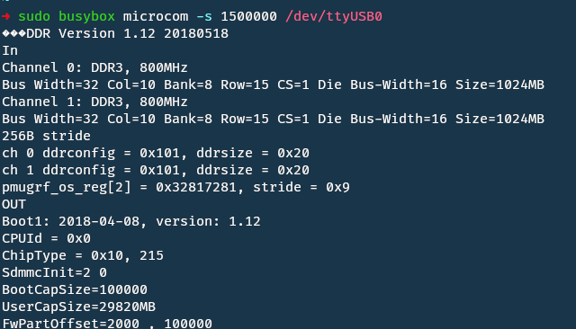
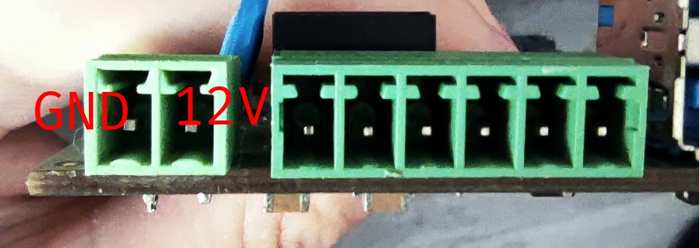
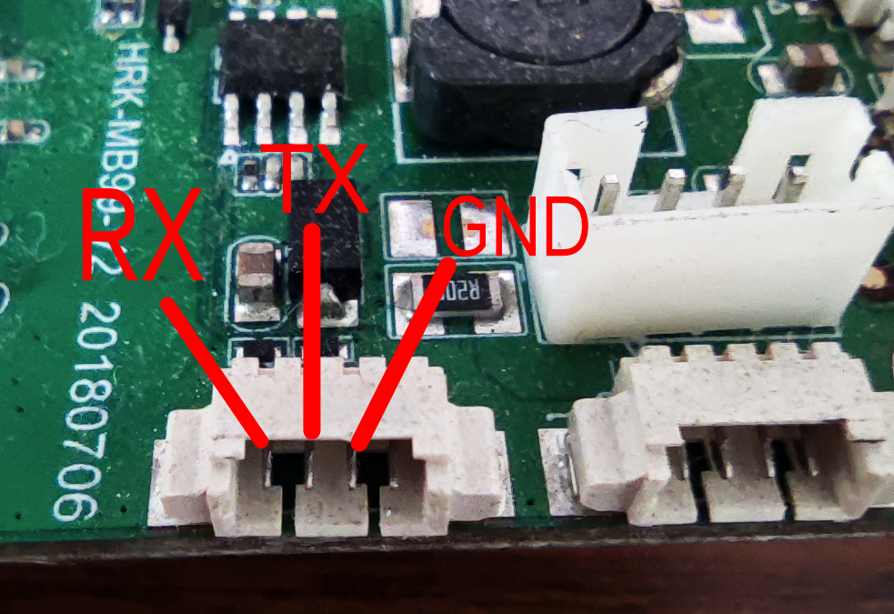
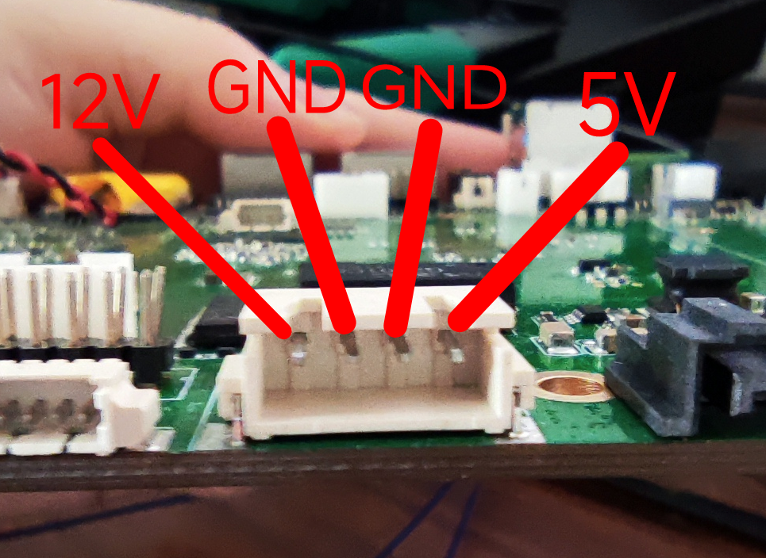
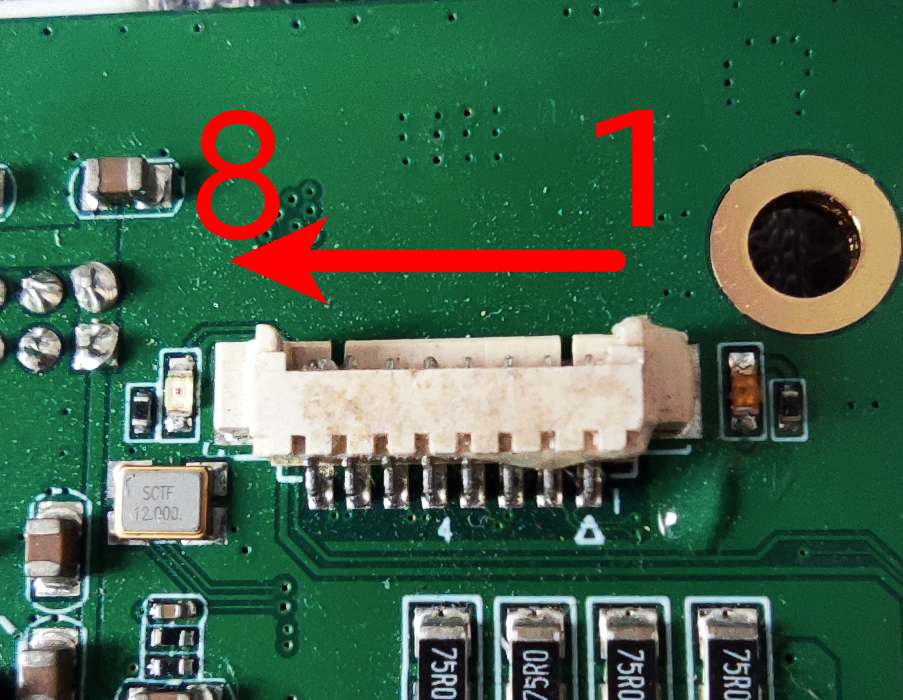

# 板子一览

## SoC与存储

SoC为RK3399

RAM为2GiB的DDR3，频率是1600MHz，这点可以从原版系统启动日志中看出：



ROM为32GiB的eMMC

## 外部IO


- 1为供电，定义如下图：



未验证过12V之外的供电

- 2为USB Type-A x2，规格均为USB 3.2 Gen1。RK3399处于Maskrom模式时，可通过上方的Type-A刷机，需要Type-A to Type-A双公头线

- 3为OMTP标准的3.5mm耳麦接口，CTIA标准的耳机插入时，只有按住耳机麦克风按钮才能正常听音乐，或者可以购买OMTP/CTIA互转线

- 4为RJ45接口，但不是以太网功能，具体什么功能未知

- 5为RJ45接口，是百兆以太网。在板子的正面可以看到HRK-MB99-V2字样，板子背面有颗8125B，猜测设计者的原意是用8152B扩展出百兆以太网给5的RJ45，但是V2版本的原理图存在Bug，只能外接子板（5上面）来实现USB 2.0转百兆以太网。在某二手市场，看到有人卖同一块板子的V3版本，但是没有这个子板，应该是V3版本原理图修复了Bug

- 6为调试UART（ttyS2），TTL电平，接插件规格为1.25mm 4pin，定义如下图：



- 7为SATA供电，接插件规格为XH 2.54mm 4pin，定义如下图：



可购买XH 2.54mm 4pin转SATA供电线，在使用前一定要确定线序，例如12V和5V有没有反，如果是反的，需要改线序

- 8为SATA数据接口，板子的SATA是通过ASM1061 PCIe to SATA芯片桥接出来的而不是USB

使用东芝TR200固态实测写入能达到200MBps

- 9为TF卡槽

- 10为Maskrom按键，按下时eMMC会不能工作，此时开机若SoC在TF卡和SPI Flash上也未检测到程序，则RK3399进入Maskrom模式

- 11为RTL8211E经过网络变压器转换后的8 pin，具有千兆带宽，接插件规格为1.25mm 8pin

要使用千兆以太网，需要1.25mm 8pin to RJ45的线，可以在网店购买，也可以自己制作

接插件的pin分别标号：



RJ45公头和母头的pin分别标号：


则连接关系为：

|接插件pin序号|RJ45公头和母头pin序号|
|--|--|
|1|1|
|2|2|
|3|3|
|4|6|
|5|4|
|6|5|
|7|7|
|8|8|

即如果RJ45公头和母头均使用T-568B线序接线，那么接插件的1到8pin应该分别接橙白、橙、绿白、绿、蓝、蓝白、棕白、棕

- 12为USB 2.0的Hub芯片

- 13为复位按键

# 主线U-Boot

参考[此处](https://github.com/retro98boy/tn3399-v3-linux#%E7%BC%96%E8%AF%91%E4%B8%BB%E7%BA%BFu-boot)编译和使用

# ALC5651

如果将仓库中的dts/dtb搭配Armbian的镜像来使用，ALC5651可以正常播放声音

如果使用仓库中的dts/dtb搭配自编译内核，ALC5651可能会不工作。这是因为ALC5651驱动存在clock上的Bug，打上两个来自Armbian的补丁再编译内核就行：

[general-rt5651-add-mclk.patch](https://github.com/armbian/build/blob/main/patch/kernel/archive/rockchip64-6.6/general-rt5651-add-mclk.patch)

[rk3399-add-sclk-i2sout-src-clock.patch](https://github.com/armbian/build/blob/main/patch/kernel/archive/rockchip64-6.6/rk3399-add-sclk-i2sout-src-clock.patch)

实测不打下面那个补丁ALC5651也能正常播放声音，但为了保险还是把下面的补丁一起打上

Armbian的镜像中自带[asound.state](https://github.com/armbian/build/blob/aee4c495a1c989723f7874b636088ba46f9fedf2/packages/blobs/asound.state/asound.state.rt5651#L4)，设置好了ALC5651的声音通路。如果是其他的发行版/rootfs的话，需要自行设置声音通路：

```
# 参考https://www.cnblogs.com/zyly/p/17591417.html
amixer -D hw:rockchiprt5651c cset name='DAC MIXL INF1 Switch' on
amixer -D hw:rockchiprt5651c cset name='DAC MIXR INF1 Switch' on
amixer -D hw:rockchiprt5651c cset name='Stereo DAC MIXL DAC L1 Switch' on
amixer -D hw:rockchiprt5651c cset name='Stereo DAC MIXR DAC R1 Switch' on
amixer -D hw:rockchiprt5651c cset name='OUT MIXR DAC R1 Switch' on
amixer -D hw:rockchiprt5651c cset name='OUT MIXL DAC L1 Switch' on
amixer -D hw:rockchiprt5651c cset name='HPOVOL L Switch' on
amixer -D hw:rockchiprt5651c cset name='HPOVOL R Switch' on
amixer -D hw:rockchiprt5651c cset name='HPO MIX HPVOL Switch' on
amixer -D hw:rockchiprt5651c cset name='HPO L Playback Switch' on
amixer -D hw:rockchiprt5651c cset name='HPO R Playback Switch' on
alsactl store
```
